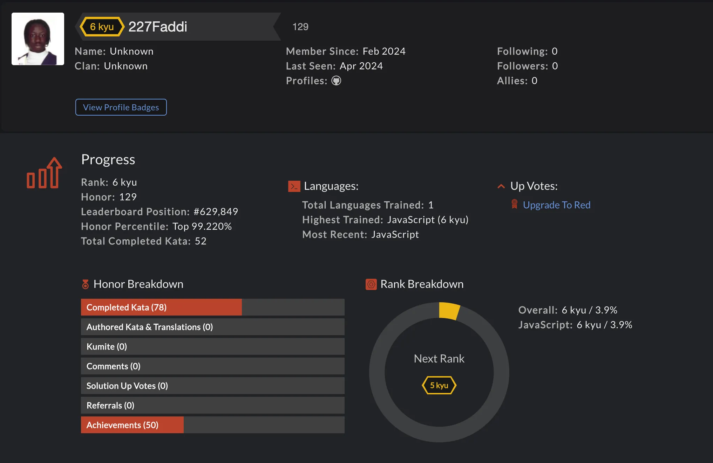

# 🕹️ CodeWars Challenges : [Visit Here](https://www.codewars.com/users/227Faddi)

All katas completed recently, pushing solutions almost every day!

## How It's Made:

**Tech used:** JavaScript

## Lessons Learned:

Regularly doing coding challenges is currently helping me learn and grasp difficult concepts, while also improving my skills.

## Other Projects:
Explore more of my recent projects on [My Portfolio](https://faliloukhouma.com).
